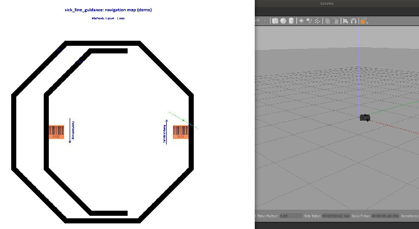

# Build and install TurtleBot demonstration (sick_line_guidance_demo)

## Prerequisites

To run the demonstrations, Gazebo must be installed in advance. Also the keys for the access to the ROS-Repos. must be updated.

```console
sudo apt-key adv --keyserver keyserver.ubuntu.com --recv-keys F42ED6FBAB17C654
sudo apt-get update 
sudo apt-get install ros-melodic-gazebo-ros-pkgs ros-melodic-gazebo-ros-control
```


## Build and install

To build and install the TurtleBot demonstration (sick_line_guidance_demo), run the following commands:

```console
cd ~/catkin_ws/src
git clone https://github.com/SICKAG/sick_line_guidance.git
cd ./sick_line_guidance/turtlebotDemo/test/scripts
./gitCloneInstall.bash
```

This will install sick_line_guidance_demo and all required packages.
Alternatively, checkout the following packages for a manual installation:
```console
# Get ros packages for turtlebot
cd ~/catkin_ws/src
git clone https://github.com/ROBOTIS-GIT/turtlebot3.git
git clone https://github.com/ROBOTIS-GIT/turtlebot3_msgs.git
git clone https://github.com/ROBOTIS-GIT/hls_lfcd_lds_driver.git
git clone https://github.com/ros-drivers/rosserial.git
# Get ros packages for turtlebot simulation
git clone https://github.com/ROBOTIS-GIT/turtlebot3_simulations
git clone https://github.com/ROBOTIS-GIT/turtlebot3_gazebo_plugin.git
# Get can_open packages
git clone https://github.com/ros-industrial/ros_canopen.git
git clone https://github.com/CANopenNode/CANopenSocket.git
git clone https://github.com/linux-can/can-utils.git
# Get sick_line_guidance package
git clone https://github.com/ros-planning/random_numbers.git
git clone https://github.com/SICKAG/sick_line_guidance.git
# Get ros packages required for robot_fsm
git clone https://github.com/uos/sick_tim.git
# Install video support for sick_line_guidance_demo
sudo apt-get install ffmpeg
sudo apt-get install vlc
# Install profiling and performance tools
git clone https://github.com/catkin/catkin_simple.git
sudo svn export https://github.com/ethz-asl/schweizer_messer/trunk/sm_common # common utilities from ethz-asl "schweizer messer" toolbox
sudo svn export https://github.com/ethz-asl/schweizer_messer/trunk/sm_timing # timing utilities from ethz-asl "schweizer messer" toolbox
sudo apt-get install google-perftools libgoogle-perftools-dev graphviz # libprofiler for profiling
```

Modify file ~/.ignition/fuel/config.yaml: Replace "url: https://api.ignitionrobotics.org" by "url: https://api.ignitionfuel.org":
```
url: https://api.ignitionrobotics.org # https://api.ignitionfuel.org
```

Build and install by running

```console
cd ~/catkin_ws
catkin_make install --cmake-args -DTURTLEBOT_DEMO="ON"
source ./install/setup.bash
```

## Run simulation

To test build and install, run a standalone simulation (no Turtlebot or additional hardware required):
```console
cd ~/catkin_ws/src/sick_line_guidance/turtlebotDemo/test/scripts
./runsimu.bash
```
You should see robots positions (marked by a green dot), following the black lines:


## Troubleshooting

### Versioncheck

Depending on OS, ROS and gcc versions, errors during build or run may occur. You can determine your versions by the following commands:
```console
cat /etc/os-release # displays the Linux distribution version
lsb_release -a      # displays the Linux/OS version (linux standard base)
uname -a            # displays the Linux kernel version
gcc --version       # displays the compiler version
rosversion -d       # displays the ros distro version
rosversion roscpp   # displays the version of ros package roscpp 
catkin --version    # displays the version of catkin tools
```

### Compiler and build errors

#### "cout is not a member of std"

:question: SynchCout.h: "error: cout is not a member of std" in package decision_making:

:white_check_mark: Include \<iostream\> in file ~/catkin_ws/src/decision_making/decision_making/include/decision_making/SynchCout.h

#### "cmake: project 'XXX' tried to find library -lpthread"

:question: cmake fails with error: "Project 'XXX' tried to find library '-lpthread'":

:white_check_mark: delete component 'thread' from find_package(Boost ... COMPONENTS ...) in CMakeLists.txt of project 'XXX'

#### "include does not exist""

:question: "CMake Error at /opt/ros/melodic/share/catkin/cmake/catkin_package.cmake:302 (message): catkin_package() include dir include does not exist"

:white_check_mark: Uncommment ~/catkin_ws/src/robot_fsm/gpio_handling/CMakeLists.txt line 30 (#INCLUDE_DIRS include)

#### "No launch file Robot_FSM.launch"

:question: "RLException: \[Robot_FSM.launch\] is neither a launch file in package \[iam\] nor is \[iam\] a launch file name"

:white_check_mark: Append the following lines in  ~/catkin_ws/src/robot_fsm/iam/CMakeLists.txt
```
install(FILES
  launch/Robot_FSM.launch
  yaml/AGC.yaml
  DESTINATION ${CATKIN_PACKAGE_SHARE_DESTINATION}
) 
```

#### "Could NOT find urdf"

:question: cmake error "Could NOT find urdf":
```
-- ==> add_subdirectory(turtlebot3/turtlebot3_description)
-- Could NOT find urdf (missing: urdf_DIR)
-- Could not find the required component 'urdf'. The following CMake error indicates that you either need to install the package with the same name or change your environment so that it can be found.
CMake Error at /opt/ros/melodic/share/catkin/cmake/catkinConfig.cmake:83 (find_package):
  Could not find a package configuration file provided by "urdf" with any of the following names:
    urdfConfig.cmake
    urdf-config.cmake
  Add the installation prefix of "urdf" to CMAKE_PREFIX_PATH or set
  "urdf_DIR" to a directory containing one of the above files.  If "urdf"
  provides a separate development package or SDK, be sure it has been
  installed.
Call Stack (most recent call first):
  turtlebot3/turtlebot3_description/CMakeLists.txt:10 (find_package)
```

:white_check_mark: Update ros dependencies by
```
cd ~/catkin_ws
rosdep update
rosdep install --from-paths ~/catkin_ws/src/turtlebot3 --ignore-src
rosdep install --from-paths ~/catkin_ws/src/ros_canopen --ignore-src
catkin_make install
```

### Runtime errors

#### "Resource not found: IAM"

:question: "roslaunch iam Robot_FSM.launch" causes "Resource not found: IAM"

:white_check_mark: Modify paths in ~/catkin_ws/src/robot_fsm/iam/launch/Robot_FSM.launch : 
replace \<rosparam command="load" file="$(find IAM)/yaml/AGC.yaml"/\> by \<rosparam command="load" file="$(find iam)/AGC.yaml"/\> and 
replace \<include file="$(find sick_line_guidance)/launch/sick_line_guidance.launch"\> by \<include file="$(find sick_line_guidance)/sick_line_guidance.launch"\>

#### "libdecision_making_ros.so: No such file or directory"

:question: "catkin_ws/install/lib/iam/robot_fsm: error while loading shared libraries: libdecision_making_ros.so: cannot open shared object file: No such file or directory"

:white_check_mark: Uncomment line 181-185 in file  ~/catkin_ws/src/decision_making/decision_making/CMakeLists.txt:
```
install(TARGETS decision_making_ros # decision_making decision_making_node
  ARCHIVE DESTINATION ${CATKIN_PACKAGE_LIB_DESTINATION}
  LIBRARY DESTINATION ${CATKIN_PACKAGE_LIB_DESTINATION}
  RUNTIME DESTINATION ${CATKIN_PACKAGE_BIN_DESTINATION}
)
```

#### "invalid topic type: OLS_Measurement"

:question: "ERROR: invalid topic type: OLS_Measurement" when sending an OLS_Measurement message to robot_fsm

:white_check_mark: Package iam (part of the robot_fsm) redefines message type OLS_Measurement. Message type iam/OLS_Measurement may differ from OLS_Measurement
definition in package sick_line_guidance. To avoid OLS_Measurement type conflicts, only OLS_Measurement messages defined in sick_line_guidance should be used.
Replace iam::OLS_Measurement by sick_line_guidance::OLS_Measurement in the following files:

```
// replace  iam::OLS_Measurement by sick_line_guidance::OLS_Measurement in file catkin_ws/src/robot_fsm/iam/include/iam/robot_fsm.h:
#include "sick_line_guidance/OLS_Measurement.h" // line 14: "iam/OLS_Measurement.h" 
void olsCallback(const sick_line_guidance::OLS_Measurement::ConstPtr& msg); // line 84: void olsCallback(const iam::OLS_Measurement::ConstPtr& msg); 
sick_line_guidance::OLS_Measurement::Type ols_msg; // line 99: iam::OLS_Measurement::Type ols_msg;

// replace  iam::OLS_Measurement by sick_line_guidance::OLS_Measurement in file catkin_ws/src/robot_fsm/iam/src/robot_fsm.cpp:
void olsCallback(const sick_line_guidance::OLS_Measurement::ConstPtr& msg){ // line 498: void olsCallback(const iam::OLS_Measurement::ConstPtr& msg){

// deactivate iam::OLS_Measurement in add_message_files(...) in file catkin_ws/src/robot_fsm/iam/CMakeLists.txt:
   # OLS_Measurement.msg
```

#### "turtlebot3_gazebo: Error in REST request"

:question: "roslaunch turtlebot3_gazebo turtlebot3_world.launch" results in error message 
"\[Err\] \[REST.cc:205\] Error in REST request libcurl: (51) SSL: no alternative certificate subject name matches target host name 'api.ignitionfuel.org'"

:white_check_mark: Replace url: https://api.ignitionrobotics.org by https://api.ignitionfuel.org in file ~/.ignition/fuel/config.yaml:
```
url: https://api.ignitionrobotics.org # https://api.ignitionfuel.org
```

#### "turtlebot3_gazebo: VMware: vmw_ioctl_command error Invalid argument. Aborted (core dumped)"

:question: "roslaunch turtlebot3_gazebo turtlebot3_world.launch" results in a core dump with an error message
"VMware: vmw_ioctl_command error Invalid argument. Aborted (core dumped)"

:white_check_mark: Uncheck "Accelerate 3D Graphics" in VMware settings and set
```console
export SVGA_VGPU10=0
export LIBGL_ALWAYS_SOFTWARE=1
```
before launching turtlebot3_gazebo.


#### Connect to bot:
```console
ssh turtlebot@192.168.178.45
```
ps turtlebot3
